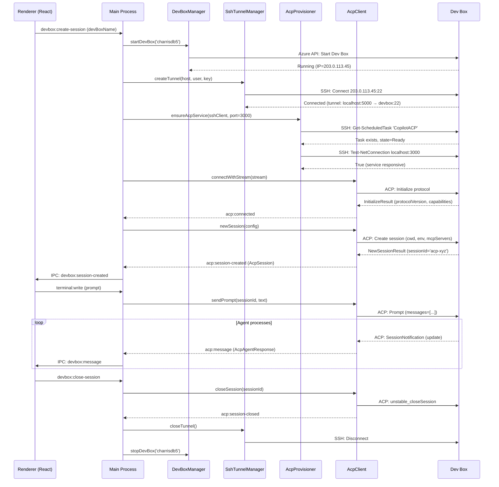
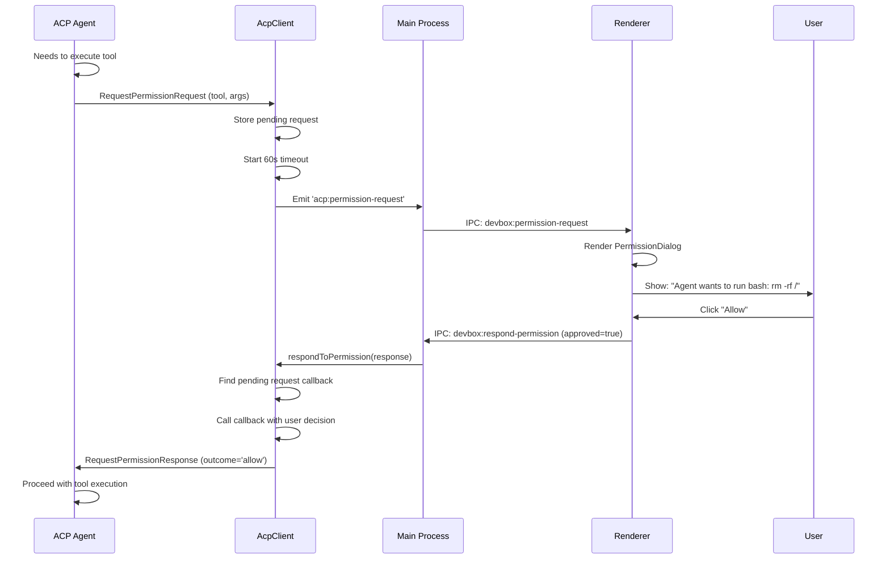

# ACP Integration Architecture

## Overview

**What is ACP?**

Agent Client Protocol (ACP) is a JSON-RPC protocol for structured communication between AI agents and clients. Tangent uses ACP to orchestrate remote agent execution on Dev Boxes, enabling users to offload CPU-intensive or resource-hungry agent tasks to cloud compute while maintaining local control and workspace sync.

**Why Tangent uses ACP for Remote Execution:**

1. **Structured Events** — ACP provides typed JSON-RPC messages (permissions, status updates, tool calls) instead of unstructured terminal output parsing
2. **Session Persistence** — ACP sessions integrate with Copilot CLI's cloud-sync for cross-device resumption
3. **Permission Callbacks** — ACP agents can request permissions, which Tangent bridges back to the local UI for user approval
4. **Transport Flexibility** — ACP is protocol-agnostic; Tangent runs it over SSH tunnels for end-to-end encryption
5. **Standardization** — ACP is Copilot CLI's official remote execution API, ensuring long-term stability

---

## Connection Flow

Step-by-step sequence from SSH tunnel establishment to active ACP session:

```
User selects remote Dev Box in UI
    ↓
[DevBoxManager] Starts Dev Box (Azure Dev Center API)
    ↓
[SshTunnelManager] Opens SSH tunnel (local:random → devbox:22)
    ↓
[AcpProvisioner] Ensures CopilotACP scheduled task exists and is running
    - Checks if task registered on Dev Box
    - Creates task if missing: `copilot --acp --port 3000 --allow-all-tools`
    - Starts task and verifies it's responsive (Test-NetConnection)
    ↓
[AcpClient] Establishes connection over SSH tunnel
    - Creates Stream: SSH tunnel + stdio bridge to ACP port 3000
    - Initializes ClientSideConnection with Tangent's Client handler
    - Handshake completes, emits 'acp:connected'
    ↓
[SessionManager] Creates ACP session
    - Calls `acpClient.newSession(config)` with workspace context
    - Maps Tangent session ID ↔ ACP session ID
    - Emits 'acp:session-created'
    ↓
[RemoteSessionManager] Syncs workspace to Dev Box
    - Runs rsync local → remote before agent starts
    - Sets MCP servers, environment, working directory
    ↓
User types prompt → Agent runs on Dev Box
    - ACP session forwards messages and events over tunnel
    - Permissions bridged to local UI for approval
    - Workspace synced back after agent completes (agentStop hook)
```

---

## Session Lifecycle

### Create Flow

**Tangent Session (Local)** → **ACP Session (Remote)**

```typescript
// 1. User selects Dev Box and agent
const sessionId = crypto.randomUUID() // e.g., 'sess-abc123'
const session = await sessionManager.create({
  remote: { devBoxName: 'charrisdb5' }
})

// 2. DevBoxManager ensures Dev Box is running
await devBoxManager.startDevBox('charrisdb5')

// 3. SshTunnelManager opens tunnel
const tunnel = await sshTunnelManager.createTunnel({
  host: '203.0.113.45', // Dev Box IP from Azure
  port: 22,
  username: 'charris',
  privateKeyPath: '~/.ssh/tangent_key'
})

// 4. AcpProvisioner verifies CopilotACP is running
await provisioner.ensureAcpService(sshClient, 3000)

// 5. AcpClient connects and creates session
await acpClient.connectWithStream(stream)
const acpSession = await acpClient.newSession({
  cwd: '/home/charris/projects/myapp',
  env: { COPILOT_WORKSPACE: '/home/charris/projects/myapp' },
  mcpServers: { /* MCP server configs */ }
})

// 6. Session ID mapping created
tangentToAcpSessionMap.set('sess-abc123', acpSession.id)
acpToTangentSessionMap.set(acpSession.id, 'sess-abc123')
```

### Resume Flow

**Session State in Cloud** → **Reconnect to Dev Box** → **Resume Session**

```typescript
// 1. Detect tunnel failure or user reconnects
await acpClient.disconnect()

// 2. Reconnect to (possibly different) Dev Box
const newTunnel = await sshTunnelManager.createTunnel(newDevBoxInfo)
await acpClient.connectWithStream(newStream)

// 3. Resume session from cloud sync
// Copilot CLI stored session state in ~/.copilot/session-state/
// ACP retrieves it when resumeSession is called
const resumedSession = await acpClient.resumeSession('acp-session-xyz')

// 4. Workspace sync (handled separately by rsync)
// Before resuming: sync Dev Box → local (to get latest output)
// After resuming: ready to send new prompts
```

### Close Flow

**Graceful Shutdown** → **Clean Up Mappings** → **Sync Final State**

```typescript
// 1. User closes session or terminates agent
await acpClient.closeSession(tangentSessionId)

// 2. AcpClient cleans up internal state
- Calls unstable_closeSession if available
- Removes from session cache and mappings
- Emits 'acp:session-closed'

// 3. SessionStore removes session and stops PTY
sessionManager.close(tangentSessionId)

// 4. SshTunnelManager closes tunnel
await sshTunnelManager.closeTunnel(devBoxName)

// 5. DevBoxManager optionally stops Dev Box (user choice)
await devBoxManager.stopDevBox('charrisdb5')
```

---

## Permission Handling

### Architecture

ACP agents request permissions for sensitive operations. Tangent bridges these to the **local UI** for user approval, maintaining the user's local control model:

```
ACP Agent (on Dev Box)
    ↓ (ACP JSON-RPC notification)
requestPermission: {
  action: "tool_execute",
  resource: "shell",
  toolName: "bash",
  args: { command: "rm -rf /" }
}
    ↓
[AcpClient] handlePermissionRequest()
    - Emits 'acp:permission-request' event
    - Stores pending request with ID
    - Starts 60-second timeout (default deny)
    ↓
[Main IPC] devbox:permission-request
    ↓ (IPC to Renderer)
[React UI] PermissionDialog
    - Shows agent, action, resource, tool name
    - User chooses: Allow / Deny / Allow Always
    ↓ (User clicks)
[IPC Handler] devbox:respond-permission
    ↓
[AcpClient] respondToPermission()
    - Finds pending request callback
    - Calls it with user's decision
    - Callback resolves with ACP response
    ↓
RequestPermissionResponse:
{
  outcome: "allow" | "deny" | "allow_always" | "deny_always"
}
    ↓
ACP Agent receives response and proceeds or stops
```

### IPC API

```typescript
// Main → Renderer: Forward permission request
ipcMain.on('devbox:permission-request', (request: AcpPermissionRequest) => {
  // Show dialog, wait for user decision
})

// Renderer → Main: User approval/denial
tangentAPI.devbox.respondPermission(response: AcpPermissionResponse)
  → ipcMain.on('devbox:respond-permission', (response) => {
      acpClient.respondToPermission(response)
    })
```

### Default Behavior

- **Timeout:** If no UI response after 60 seconds, permission is **denied**
- **"Allow Always":** User can opt to remember decision (stored in `~/.tangent-2/permission-cache.json`)
- **Deny-by-Default:** Unknown sessions or malformed requests default to deny

---

## Error Recovery

### Tunnel Drops

**Scenario:** SSH tunnel closes mid-agent-run (network glitch, timeout)

```
[SshTunnelManager] Detects socket close
    ↓
Emit 'tunnel:closed' event
    ↓
[DevBoxManager] Updates connection status to 'reconnecting'
    ↓
Send IPC to renderer: 'devbox:connection-lost'
    ↓
UI shows "Connection Lost" dialog with options:
  - Reconnect (retry same Dev Box)
  - Switch Dev Box (pick different box)
  - Continue Locally (sync workspace, create local PTY)
    ↓
User chooses "Reconnect"
    ↓
[SshTunnelManager] Implements exponential backoff:
  - Attempt 1: 1s delay
  - Attempt 2: 2s delay
  - Attempt 3: 4s delay
  - ... up to max 30s delay
  - Max 5 attempts (configurable)
    ↓
If reconnect succeeds:
  - Re-establish SSH tunnel
  - Re-establish ACP connection
  - Call acpClient.resumeSession(sessionId)
  - Trigger rsync to sync workspace IN (latest from Dev Box)
    ↓
If all reconnect attempts fail:
  - UI shows "Reconnection Failed" 
  - User must pick different Dev Box or continue locally
```

### ACP Service Crash

**Scenario:** CopilotACP process dies on Dev Box

```
[AcpClient] Detects connection.closed promise resolves
    ↓
Emit 'acp:error' with reason
    ↓
[SshTunnelManager] Checks if tunnel still alive
    ↓
If tunnel alive:
  - [AcpProvisioner] verifyAcpService() checks if process responsive
  - If not: restarts scheduled task via SSH: Start-ScheduledTask
  - Waits for service to be responsive (loop with Test-NetConnection)
    ↓
If service recovers:
  - Reconnect AcpClient with new stream
  - Resume session with resumeSession()
    ↓
If service cannot recover (e.g., broken binary):
  - Emit 'devbox:service-unavailable'
  - UI prompts user to provision new Dev Box or continue locally
```

### Workspace Sync Conflicts

**Scenario:** Local changes conflict with inbound sync from Dev Box

```
Before resuming session after disconnect:
  - [RsyncManager] runs rsync Dev Box → local
  - If conflicts detected (uncommitted local changes + incoming remote changes):
    ↓
    UI shows "Sync Conflict" dialog:
      - Keep Local (discard remote changes)
      - Use Remote (overwrite with Dev Box version)
      - Merge (open diff tool, e.g., meld, Beyond Compare)
    ↓
    User chooses → merge tool shows diff
    User resolves → sync completes → session resumes
```

---

## Architecture Diagram

### Session Connection Sequence (Mermaid)



### Permission Request Flow



---

## Key Files

### Client Implementation

| File | Responsibility |
|------|-----------------|
| `src/main/devbox/AcpClient.ts` | Core ACP protocol client. Wraps `@agentclientprotocol/sdk` ClientSideConnection. Manages session creation, resumption, messaging, and permission callbacks. Maps Tangent session IDs ↔ ACP session IDs. |
| `src/main/devbox/AcpProvisioner.ts` | Ensures CopilotACP scheduled task exists and is running on Dev Box. Checks task state, creates task if missing, verifies service responsiveness. |
| `src/main/devbox/DevBoxManager.ts` | Manages Dev Box lifecycle (list, start, stop, health check). Uses Azure Dev Center API via `@microsoft/devbox-mcp` package. |
| `src/main/devbox/SshTunnelManager.ts` | Opens/closes SSH tunnels to Dev Boxes. Creates stdio stream from SSH connection. Implements reconnect with exponential backoff. |
| `src/main/devbox/DevBoxConnector.ts` | Orchestrator: coordinates DevBoxManager, SshTunnelManager, AcpProvisioner, and AcpClient to establish end-to-end connection. |

### Type Definitions

| File | Responsibility |
|------|-----------------|
| `src/shared/acp-types.ts` | TypeScript interfaces for ACP protocol: AcpSession, AcpSessionConfig, AcpPermissionRequest/Response, AcpAgentResponse, AcpToolExecution, AcpConnectionState, AcpEvent, AcpMessage, AcpConnectionOptions. |
| `src/shared/devbox-types.ts` | TypeScript interfaces for Dev Box infrastructure: DevBoxResource, DevBoxProject, DevBoxConnectionInfo, DevBoxProvisioningState, DevBoxHealthStatus, DevBoxConfig, DevBoxProvisioningConsent, DevBoxSyncConfig. |

### IPC Integration

| File | Responsibility |
|------|-----------------|
| `src/main/ipc/handlers.ts` | Registers IPC handlers for devbox operations. Routes renderer requests to DevBoxManager, AcpClient, SshTunnelManager. Forwards ACP events to renderer via `webContents.send()`. |
| `src/preload/index.ts` | Exposes `tangentAPI.devbox.*` namespace via contextBridge for renderer to call devbox IPC. |

### Workspace Sync

| File | Responsibility |
|------|-----------------|
| `src/main/devbox/RsyncManager.ts` | Runs rsync local ↔ remote for workspace sync. Detects conflicts, emits conflict dialog events. Filters exclusions from `~/.tangent-2/sync-config.json`. |

---

## SDK API Surface

### ACP SDK: `@agentclientprotocol/sdk` (v0.18.2+)

Tangent uses a **minimal Client implementation** because Tangent is a **CLIENT** connecting to remote ACP agents, not an agent itself.

#### ClientSideConnection

```typescript
// Create connection from Tangent client's side
const client: Client = {
  requestPermission: async (params: RequestPermissionRequest) => RequestPermissionResponse,
  sessionUpdate: async (notification: SessionNotification) => void
}

const connection = new ClientSideConnection(() => client, stream)

// Initialize handshake
await connection.initialize({
  protocolVersion: '1.0',
  clientInfo: { name: 'Tangent', version: '2.0.0' },
  capabilities: { experimental: {} }
})

// Session operations
const createResult = await connection.newSession({ cwd, env, mcpServers })
const resumeResult = await connection.unstable_resumeSession({ sessionId })
const closeResult = await connection.unstable_closeSession({ sessionId })

// Messaging
await connection.prompt({ sessionId, messages: [...] })

// Events
connection.closed: Promise<void> // Fires when connection closes
```

#### Client Interface (Minimal)

Tangent only implements two methods:

```typescript
interface Client {
  requestPermission(params: RequestPermissionRequest): Promise<RequestPermissionResponse>
  sessionUpdate(notification: SessionNotification): Promise<void>
}
```

**Why Minimal?**
- Tangent doesn't respond to agent queries (no tool execution on Tangent side)
- Tangent is stateless w.r.t. the protocol (Dev Box agents handle all state)
- Future expansion: can add more Client methods as needs evolve

#### Session Operations

```typescript
// Create new session
newSession(request: {
  cwd: string
  env?: Record<string, string>
  mcpServers?: Record<string, unknown>
}): Promise<NewSessionResponse>

// Resume session (no history replay)
unstable_resumeSession(request: {
  sessionId: string
}): Promise<ResumeSessionResponse>

// Load session (replays history)
loadSession(request: {
  sessionId: string
}): Promise<LoadSessionResponse>

// Close session
unstable_closeSession(request: {
  sessionId: string
}): Promise<void>

// Send messages
prompt(request: {
  sessionId: string
  messages: Message[]
}): Promise<void>
```

#### Events

ACP sends notifications to Client as **JSON-RPC notifications**:

```typescript
type SessionNotification = {
  sessionId: string
  update?: {
    messages?: Message[]
    toolCalls?: ToolCall[]
    usage?: { inputTokens, outputTokens, cacheReadTokens, cacheWriteTokens }
    stopReason?: 'end_turn' | 'max_tokens' | 'tool_use' | 'cancelled' | 'error'
  }
}
```

Tangent converts these to `AcpAgentResponse` for renderer consumption.

#### Permission Protocol

```typescript
type RequestPermissionRequest = {
  sessionId: string
  action: string         // e.g., "tool_execute"
  resource: string       // e.g., "shell"
  toolName?: string      // e.g., "bash"
  args?: unknown
}

type RequestPermissionResponse = {
  outcome: 'allow' | 'deny' | 'allow_always' | 'deny_always'
}
```

---

## Event Flow Summary

### Main Process → AcpClient → Renderer

```
AcpClient (EventEmitter)
├─ acp:connected                          → Main broadcasts to UI
├─ acp:disconnected                       → Main broadcasts to UI
├─ acp:session-created (AcpSession)       → Main broadcasts to UI
├─ acp:message (AcpAgentResponse)         → Main broadcasts to UI
├─ acp:permission-request (AcpPermissionRequest)  → Main shows dialog
└─ acp:error (Error)                      → Main logs and broadcasts

IPC Events (Main → Renderer)
├─ devbox:connection-status (state)
├─ devbox:session-created (session)
├─ devbox:message (response)
├─ devbox:permission-request (request)    ← User must respond
├─ devbox:connection-lost
└─ devbox:service-unavailable
```

### Renderer → Main → AcpClient

```
IPC Handlers (Renderer → Main)
├─ devbox:create-session (devBoxName)     → DevBoxManager + AcpClient
├─ devbox:close-session (sessionId)       → AcpClient.closeSession()
├─ devbox:send-prompt (sessionId, text)   → AcpClient.sendPrompt()
├─ devbox:list-dev-boxes ()               → DevBoxManager.listDevBoxes()
├─ devbox:start-dev-box (name)            → DevBoxManager.startDevBox()
├─ devbox:stop-dev-box (name)             → DevBoxManager.stopDevBox()
├─ devbox:reconnect (devBoxName)          → SshTunnelManager reconnect
└─ devbox:respond-permission (response)   → AcpClient.respondToPermission()
```

---

## Implementation Notes

### Session ID Mapping

Tangent maintains **bidirectional mappings** to bridge local and remote session IDs:

```typescript
// In AcpClient
private tangentToAcpSessionMap = new Map<string, string>()   // Local → Remote
private acpToTangentSessionMap = new Map<string, string>()   // Remote → Local

// Created when new session made
tangentToAcpSessionMap.set('sess-abc123', 'acp-xyz')
acpToTangentSessionMap.set('acp-xyz', 'sess-abc123')

// Used for message routing
const acpSessionId = tangentToAcpSessionMap.get(tangentSessionId)
const tangentSessionId = acpToTangentSessionMap.get(acpSessionId)
```

### Permission Request Timeout

Permission requests have a **60-second timeout** with default **deny**:

```typescript
return new Promise<RequestPermissionResponse>((resolve) => {
  this.pendingPermissionRequests.set(request.id, callback)
  this.emit('acp:permission-request', request)
  
  // Auto-deny after 60s
  setTimeout(() => {
    if (this.pendingPermissionRequests.has(request.id)) {
      this.pendingPermissionRequests.delete(request.id)
      resolve({ outcome: 'deny' })  // Deny by default
    }
  }, 60000)
})
```

This prevents agents from hanging indefinitely if UI crashes or permission dialog is dismissed.

### Stream Creation

ACP protocol expects a **Stream** object (readable + writable):

```typescript
// SSH tunnel provides stdio as stream
const stream = new Stream({
  read: () => { /* SSH socket readable */ },
  write: (chunk) => { /* SSH socket writable */ }
})

// Passed to AcpClient
await acpClient.connectWithStream(stream)
```

Stream creation is delegated to **SshTunnelManager** to allow flexible transport (future: WebSocket, local pipe, etc.).

---

## Testing Strategy

### Unit Tests

- `AcpClient`: Session creation/resumption, permission callbacks, mapping correctness
- `AcpProvisioner`: Service check, task creation, verification with mocked SSH
- `DevBoxManager`: API integration (mocked)
- `SshTunnelManager`: Tunnel creation, reconnect backoff, stream setup

### Integration Tests

- End-to-end connection: Dev Box start → SSH tunnel → ACP connect → session create
- Permission flow: Request → UI → Response
- Sync conflicts: Detect and resolve
- Failover: Tunnel drop → reconnect → resume

### E2E Tests

- UI: Start remote session, see connection status, send prompt, handle permission dialog
- UI: Reconnection dialog after tunnel drop
- UI: Sync conflict resolution

### Mocking Strategy

Use `@microsoft/devbox-mcp` mock or stub to avoid live Azure dependencies in CI.

---

## Security Considerations

1. **SSH Tunnel** — End-to-end encryption for all ACP traffic
2. **Private Keys** — Stored in `~/.ssh/`, never transmitted or logged
3. **Permission Approval** — User decision required for sensitive tools; no auto-allow
4. **Timeout Fallback** — Permission denied if no UI response (fail-safe)
5. **Session Isolation** — Each session has unique ID; no cross-session access
6. **Workspace Isolation** — Sync exclusions prevent sensitive files (`.env`, `.git`) from leaving local machine
